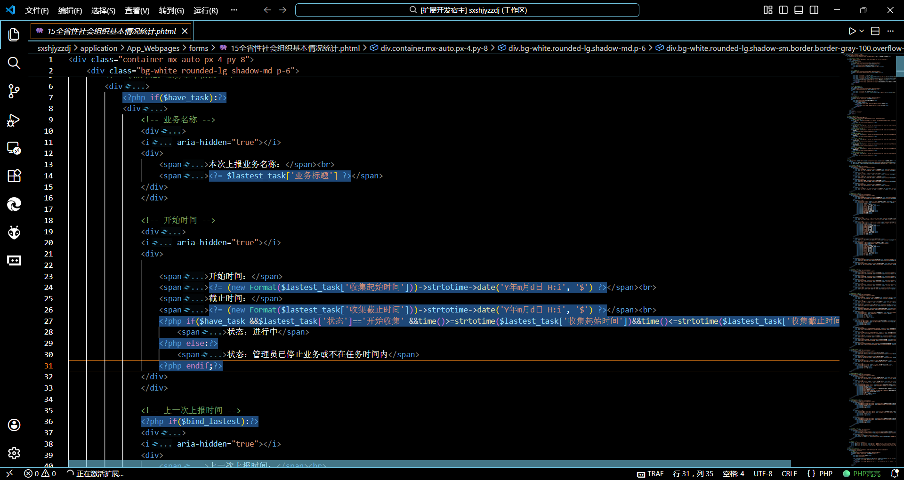

# PHP Snippet Highlighter

为VS Code中的PHP代码块添加自定义背景高亮，提升混合文件（HTML/Blade/PHTML）的代码可读性。

## 功能特点

✅ 自动识别PHP代码块并添加背景高亮  
✅ 支持自定义背景色（rgba/hex/rgb格式）  
✅ 支持多语言文件（HTML/Blade/PHTML/PHP等）  
✅ 一键开关高亮（状态栏/右键菜单/命令面板）  
✅ 实时配置更新，无需重启VS Code

## 使用方法

1.  安装插件后自动激活
2.  状态栏右侧会显示「🟢 PHP高亮」，点击可切换开关
3.  右键菜单选择「Toggle PHP Snippet Highlight」快速切换
4.  命令面板（Ctrl+Shift+P）执行：
    *   `PHP Highlighter: Toggle PHP Snippet Highlight` - 切换高亮
    *   `PHP Highlighter: Change PHP Snippet Background Color` - 修改背景色

## 配置项

在「设置」中搜索 `PHP Snippet Highlighter` 可配置：

*   `phpSnippetHighlighter.backgroundColor` - PHP代码块背景色（默认：rgba(50, 120, 200, 0.15)）
*   `phpSnippetHighlighter.supportedLanguages` - 启用高亮的语言ID列表（默认：\["html", "blade", "phtml", "php"\]）

## 截图

## 常见问题

Q: 如何查看当前文件的语言ID？  
A: 命令面板执行「Inspect Editor Language」即可查看

Q: 背景色不生效？  
A: 请检查颜色格式是否合法，或重启VS Code尝试

## 反馈

如有问题请提交Issue：https://github.com/lirui0407/php-snippet-highlighter/issues
